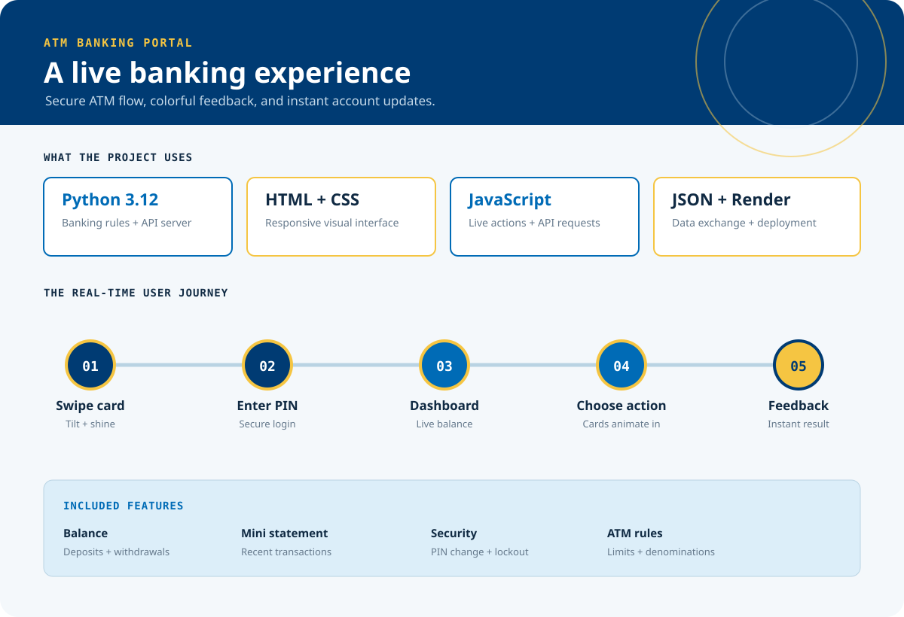
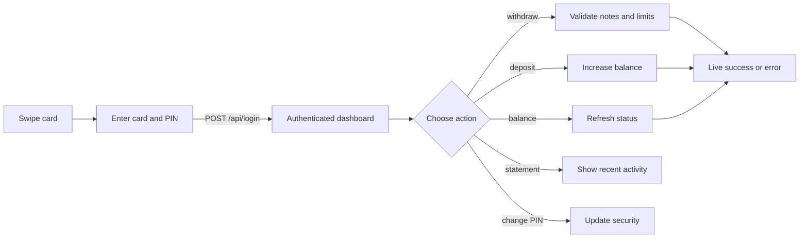

# ATM Banking Portal

An interactive, fan-made SBI-inspired ATM web experience built to feel like a real banking terminal rather than a static form. The first screen introduces a virtual card, live service indicators, motion feedback, and a guided path into authentication, account actions, and transaction history.

> This is an independent, non-commercial learning project. SBI and related names, marks, and visual identities belong to their respective owners.

[](https://www.python.org/)
[](https://developer.mozilla.org/en-US/docs/Web/HTML)
[](https://developer.mozilla.org/en-US/docs/Web/CSS)
[](https://developer.mozilla.org/en-US/docs/Web/JavaScript)
[](https://render.com/)

**Interactive card swipe** | **Live status clock** | **Animated dashboard** | **Instant transaction feedback**

<table>
    <tr>
        <td bgcolor="#003b73" width="25%"><font color="#ffffff"><strong>01 · ENTER</strong><br>Swipe the virtual card</font></td>
        <td bgcolor="#006bb6" width="25%"><font color="#ffffff"><strong>02 · VERIFY</strong><br>Check card and PIN</font></td>
        <td bgcolor="#f5c542" width="25%"><font color="#102a43"><strong>03 · EXPLORE</strong><br>Open the account dashboard</font></td>
        <td bgcolor="#dceef9" width="25%"><font color="#102a43"><strong>04 · COMPLETE</strong><br>Get instant feedback</font></td>
    </tr>
</table>

<p align="center"><strong>Color has a job:</strong> deep blue establishes trust, bright blue signals interaction, gold marks attention, and cyan surfaces keep account information easy to scan.</p>

## Preview

[](#preview)


The screenshot shows the visual starting point. In the live experience, the card responds to the cursor, the reader scans continuously, the service clock updates every second, and the dashboard refreshes after each successful API action.



<table>
    <tr>
        <td bgcolor="#102a43"><font color="#ffffff"><strong>LIVE VISUAL SIGNALS</strong><br><sub>Clock, pulse, reader scan, and balance states update while the app is running.</sub></font></td>
        <td bgcolor="#f5c542"><font color="#102a43"><strong>INTERACTIVE DEPTH</strong><br><sub>Cursor movement tilts the card and hover motion reveals its shine.</sub></font></td>
        <td bgcolor="#006bb6"><font color="#ffffff"><strong>REAL API FEEDBACK</strong><br><sub>Every account action returns a visible success or validation result.</sub></font></td>
    </tr>
</table>

## What Visitors Experience

[](#what-visitors-experience)

<table>
    <tr>
        <td align="center" width="20%"><br><strong>Swipe card</strong><br><sub>Animated card and reader</sub></td>
        <td align="center" width="20%">&#8594;</td>
        <td align="center" width="20%"><br><strong>Enter PIN</strong><br><sub>Secure authentication</sub></td>
        <td align="center" width="20%">&#8594;</td>
        <td align="center" width="20%"><br><strong>Open account</strong><br><sub>Live dashboard</sub></td>
    </tr>
    <tr>
        <td colspan="5" align="center">&#8595;</td>
    </tr>
    <tr>
        <td align="center" width="20%"><br><strong>See result</strong><br><sub>Success or validation message</sub></td>
        <td align="center" width="20%">&#8592;</td>
        <td align="center" width="20%"><br><strong>Choose service</strong><br><sub>Balance, cash, PIN, history</sub></td>
        <td colspan="2"></td>
    </tr>
</table>

- A focused ATM entry screen with an animated virtual card and card-reader slot.
- A cursor-controlled 3D tilt that gives the card depth as the visitor moves across it.
- A moving card shine effect and a smooth slide into the reader after pressing **Swipe card**.
- Live service and machine clocks that update every second.
- A secure card-number and four-digit PIN login flow with lockout after three failed attempts.
- A responsive account dashboard with balance, daily limit, withdrawn amount, and ATM cash status.
- Action cards for balance checks, withdrawals, deposits, mini statements, and PIN changes.
- Instant success and error messages beside the action that produced them.
- Responsive layouts that keep the experience usable on desktop and mobile screens.

## Project Vision

[](#project-vision)

The goal is to turn a familiar banking workflow into a small interactive product experience. Instead of presenting disconnected forms, the project guides visitors through a clear visual sequence: enter the ATM, authenticate, choose an action, and see the account state change immediately.

The experience is designed for:

- Learners practicing frontend interactions, HTTP APIs, and form validation.
- Portfolio visitors evaluating responsive interface design and CSS motion.
- Developers studying how a browser UI can communicate with a dependency-free Python backend.
- Designers exploring how color, depth, spacing, and feedback can make an operational tool feel approachable.

<table>
    <tr>
        <td bgcolor="#dceef9" align="center"><strong>AUTHENTICATE</strong><br><font color="#64788b">Card number + PIN</font></td>
        <td bgcolor="#b9d3e3" align="center">&#8594;</td>
        <td bgcolor="#dceef9" align="center"><strong>MANAGE</strong><br><font color="#64788b">Balance + transactions</font></td>
        <td bgcolor="#b9d3e3" align="center">&#8594;</td>
        <td bgcolor="#f5c542" align="center"><strong>UNDERSTAND</strong><br><font color="#102a43">Clear instant feedback</font></td>
    </tr>
</table>

## How It Works

[](#how-it-works)

1. `web_app.py` starts the Python HTTP server and serves the frontend files.
2. `index.html` provides the ATM screens, forms, dashboard, and action controls.
3. `styles.css` defines the SBI-inspired blue, gold, cyan, and white visual system, responsive layout, shadows, transitions, and keyframe animations.
4. `app.js` updates both clocks, handles card motion, controls screen transitions, and sends JSON requests to the backend.
5. The backend validates login attempts, balances, withdrawal limits, denominations, deposits, statements, and PIN changes.
6. Successful responses update the dashboard in place without a full page reload.

### Experience Architecture



## Technology Stack

[](#technology-stack)

| Technology | Purpose |
| --- | --- |
| **Python 3.12** | Banking rules, state management, and HTTP server |
| **Python `http.server`** | Serves the frontend and JSON API endpoints |
| **HTML5** | Accessible page structure, forms, and dashboard markup |
| **CSS3** | Responsive layout, color system, card depth, hover effects, and animation |
| **Vanilla JavaScript** | DOM interaction, clock updates, API calls, and live state changes |
| **JSON** | Communication between the browser and backend |
| **Render** | Deployment through `render.yaml` |

<p align="center">
       
</p>

## Visual Effects

[](#visual-effects)

The visual language is built from lightweight browser-native effects:

- **Card depth:** pointer movement changes CSS custom properties for a restrained 3D tilt.
- **Card shine:** a diagonal highlight travels across the card on hover.
- **Reader scan:** the card-reader line pulses while the ATM is waiting.
- **Live signals:** service and machine indicators use a soft pulse to show availability.
- **Motion hierarchy:** login, dashboard, transaction, and action-card sections enter with staggered transitions.
- **Balance feedback:** the balance panel briefly highlights when account data changes.
- **Color states:** blue identifies the system, gold marks attention and readiness, and green-blue feedback marks successful actions.
- **Reduced motion:** users who prefer less motion receive shortened animations and transitions.

## Roadmap

[](#roadmap)

The current build focuses on the core ATM flow. Future iterations can grow the experience with:

- Persistent account storage instead of in-memory state.
- Multiple demo accounts and account switching.
- More detailed transaction receipts and export options.
- Keyboard-first navigation and stronger screen-reader announcements.
- A dedicated mobile navigation treatment.
- Automated browser checks for login, transactions, lockout, and responsive layouts.

## Project Structure

[](#project-structure)

```text
.
├── README.md
├── readme-overview.svg
├── atm.py
├── web_app.py
├── render.yaml
└── web/
    ├── app.js
    ├── index.html
    └── styles.css
```

## Run Locally

[](#run-locally)

From the project directory:

```bash
python web_app.py
```

Then open [http://localhost:8000](http://localhost:8000) in a browser. The server uses the `PORT` environment variable when one is provided, so the same command also works with the included Render configuration.

Useful validation command:

```bash
python -m py_compile web_app.py
```

## API Endpoints

[](#api-endpoints)

| Method | Endpoint | Purpose |
| --- | --- | --- |
| `GET` | `/api/status` | Returns current account and ATM status |
| `POST` | `/api/login` | Authenticates a card number and PIN |
| `POST` | `/api/action` | Handles balance, deposit, withdrawal, statement, PIN change, and logout actions |

## Deployment

[](#deployment)

The included `render.yaml` defines a Python web service named `sbi-atm`:

```text
Build command: python -m py_compile web_app.py
Start command: python web_app.py
```